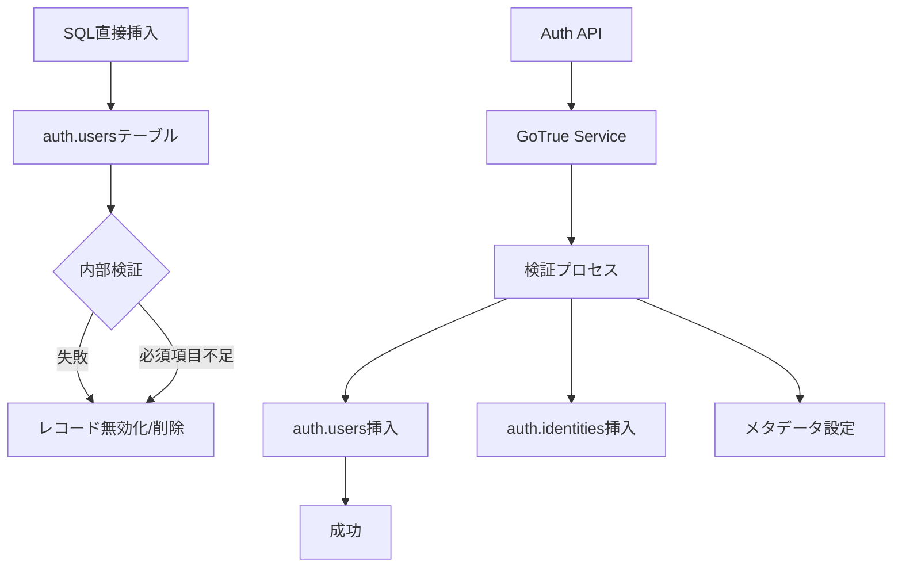

# auth.usersテーブルへの直接挿入問題の詳細解説

## 🔍 問題の概要

Supabaseのauth.usersテーブルに直接SQLでユーザーを挿入しようとすると、一見成功したように見えても実際にはユーザーが作成されない問題があります。

## 📋 現象

### 試みたこと
```sql
-- seedファイルでの直接挿入
INSERT INTO auth.users (
    id,
    email,
    encrypted_password,
    email_confirmed_at,
    created_at,
    updated_at
) VALUES (
    gen_random_uuid(),
    'test@example.com',
    crypt('password123', gen_salt('bf')),
    NOW(),
    NOW(),
    NOW()
);
```

### 結果
- エラーは発生しない
- SELECTクエリでもデータが見えない
- ユーザーとしてログインできない

## 🔬 原因分析

### 1. Supabaseの内部アーキテクチャ

Supabaseのauth.usersテーブルは特殊な管理下にあり：

1. **GoTrue認証サービス**が管理
2. **内部トリガー**による整合性チェック
3. **関連テーブル**（auth.identities等）との同期が必要
4. **JWTトークン生成**プロセスとの連携

### 2. 直接挿入が失敗する理由



### 3. 必要な関連データ

auth.usersに加えて、以下のデータも同時に作成が必要：

```sql
-- auth.identitiesテーブル
INSERT INTO auth.identities (
    id,
    user_id,
    identity_data,
    provider,
    last_sign_in_at,
    created_at,
    updated_at
) VALUES (...);

-- その他の内部メタデータ
-- - セッション管理
-- - リフレッシュトークン
-- - 監査ログ
```

## ✅ 正しい解決方法

### 1. Admin API使用（推奨）

```bash
#!/bin/bash
# scripts/create-auth-users.sh

SUPABASE_URL="http://localhost:54321"
SERVICE_ROLE_KEY="your-service-role-key"

curl -X POST "${SUPABASE_URL}/auth/v1/admin/users" \
  -H "apikey: ${SERVICE_ROLE_KEY}" \
  -H "Authorization: Bearer ${SERVICE_ROLE_KEY}" \
  -H "Content-Type: application/json" \
  -d '{
    "email": "test@example.com",
    "password": "password123",
    "email_confirm": true,
    "user_metadata": {
      "name": "Test User"
    }
  }'
```

### 2. JavaScript Admin SDK

```javascript
// Node.js環境での実行
import { createClient } from '@supabase/supabase-js'

const supabase = createClient(
  process.env.SUPABASE_URL,
  process.env.SERVICE_ROLE_KEY,
  {
    auth: {
      autoRefreshToken: false,
      persistSession: false
    }
  }
)

async function createUser() {
  const { data, error } = await supabase.auth.admin.createUser({
    email: 'test@example.com',
    password: 'password123',
    email_confirm: true,
    user_metadata: {
      name: 'Test User'
    }
  })
  
  if (error) console.error('Error:', error)
  else console.log('User created:', data)
}
```

### 3. Supabase CLIでの対話的作成

```bash
# Supabase Studioを開く
pnpm db:studio

# ブラウザで http://localhost:54323 にアクセス
# Authentication > Users から手動で作成
```

## 🎯 ベストプラクティス

### 1. 開発環境のセットアップ

```bash
# 1. 初回のみ：テストユーザー作成スクリプトを実行
./scripts/create-auth-users.sh

# 2. その後のリセット時
pnpm db:reset  # テーブルとシードデータのみリセット
```

### 2. シードファイルの構成

```sql
-- supabase/seed.sql
-- auth.usersへの直接挿入は含めない

-- ユーザーIDの取得（既に作成済みのユーザーから）
DO $$
DECLARE
    user_id UUID;
BEGIN
    SELECT id INTO user_id 
    FROM auth.users 
    WHERE email = 'test@example.com';
    
    IF user_id IS NOT NULL THEN
        -- ユーザー関連データの作成
        INSERT INTO public.profiles (id, ...)
        VALUES (user_id, ...);
    END IF;
END $$;
```

### 3. CI/CD環境での対応

```yaml
# .github/workflows/test.yml
steps:
  - name: Setup Supabase
    run: supabase start
    
  - name: Create test users
    run: |
      # Admin APIでテストユーザーを作成
      ./scripts/create-auth-users.sh
    
  - name: Run tests
    run: pnpm test
```

## 📊 比較表

| 方法 | 動作 | 推奨度 | 用途 |
|------|------|--------|------|
| SQL直接挿入 | ❌ | 使用禁止 | - |
| Admin API | ✅ | ⭐⭐⭐⭐⭐ | 開発・テスト |
| JS Admin SDK | ✅ | ⭐⭐⭐⭐⭐ | プログラマティック |
| Supabase Studio | ✅ | ⭐⭐⭐⭐ | 手動・少数 |
| SignUp API | ✅ | ⭐⭐⭐ | 本番ユーザー |

## 🚨 注意事項

### セキュリティ
- `service_role_key`は絶対に公開しない
- Admin APIは開発環境でのみ使用
- 本番環境では通常のSignUp APIを使用

### パフォーマンス
- 大量ユーザー作成時はバッチ処理を検討
- レート制限に注意（Admin APIも制限あり）

### データ整合性
- ユーザー削除時は関連データも削除
- カスケード削除の設定を確認

## 🔗 関連情報

- [Supabase Auth ドキュメント](https://supabase.com/docs/guides/auth)
- [GoTrue API リファレンス](https://github.com/supabase/gotrue)
- [Admin API ガイド](https://supabase.com/docs/reference/javascript/auth-admin-createuser)